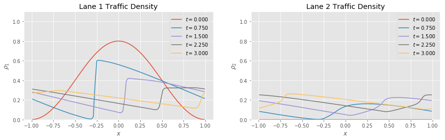

# Final Project

This directory contains files related to the final project, including the
proposal and the project itself. My project subject was modeling vehicular
traffic in two travel lanes, which takes the form of a system of two balance
equations similar to the traffic equation studied in lecture.

The project discussion and most of its code is is in a Jupyter Notebook file,
[_project.ipynb_](project.ipynb). Some solver code, including slope limiters and
the `ode_rkexplicit` function from lecture, is included through
[_support.py_](support.py).
